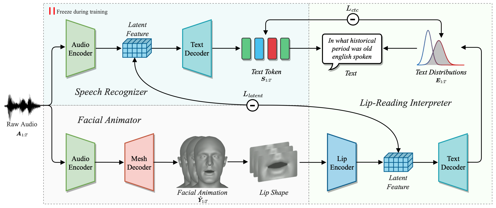

# SelfTalk: A Self-Supervised Commutative Training Diagram to Comprehend 3D Talking Faces [ACM MM 2023]

Official PyTorch implementation for the paper:

> **SelfTalk: A Self-Supervised Commutative Training Diagram to Comprehend 3D Talking Faces**, ***ACM MM 2023***.
>
> Ziqiao Peng, Yihao Luo, Yue Shi, Hao Xu, Xiangyu Zhu, Hongyan Liu, Jun He, Zhaoxin Fan
>
>  [Arxiv](https://arxiv.org/abs/2306.10799) | [Project Page](https://ziqiaopeng.github.io/selftalk/) | [License](https://github.com/psyai-net/SelfTalk_release/blob/main/LICENSE)


<p align="center">

</p>

> Given a speech signal as input, our framework can generate realistic 3D talking faces showing comprehensibility by recovering coherent textual information through the lip-reading interpreter and the speech recognizer.

## **Environment**

- Linux
- Python 3.6+
- Pytorch 1.12.1
- CUDA 11.3
- ffmpeg
- [MPI-IS/mesh](https://github.com/MPI-IS/mesh)

Clone the repo:
  ```bash
  git clone https://github.com/psyai-net/SelfTalk_release.git
  cd SelfTalk_release
  ```  
Create conda environment:
```bash
conda create -n selftalk python=3.8.8
conda activate selftalk
pip install torch==1.12.1+cu113 torchvision==0.13.1+cu113 torchaudio==0.12.1 --extra-index-url https://download.pytorch.org/whl/cu113
pip install -r requirements.txt
```

## **Dataset**
### VOCASET
Request the VOCASET data from [https://voca.is.tue.mpg.de/](https://voca.is.tue.mpg.de/). Place the downloaded files `data_verts.npy`, `raw_audio_fixed.pkl`, `templates.pkl` and `subj_seq_to_idx.pkl` in the folder `vocaset/`. Download "FLAME_sample.ply" from [voca](https://github.com/TimoBolkart/voca/tree/master/template) and put it in `vocaset/`. Read the vertices/audio data and convert them to .npy/.wav files stored in `vocaset/vertices_npy` and `vocaset/wav`:
```
cd vocaset
python process_voca_data.py
```

### BIWI

Follow the [`BIWI/README.md`](BIWI/README.md) to preprocess BIWI dataset and put .npy/.wav files into `BIWI/vertices_npy` and `BIWI/wav`, and the `templates.pkl` into `BIWI/`.


## **Demo**

Download the pretrained models from [BIWI.pth](https://drive.google.com/file/d/1ZGdEVcLa3W0SLMGXOYOJlxikHALhqQ7s/view?usp=sharing) and [vocaset.pth](https://drive.google.com/file/d/1iwxw4snYndoip2u2Iwe7h-rfPhVJRm2U/view?usp=sharing). Put the pretrained models under `BIWI` and `VOCASET` folders, respectively. Given the audio signal,
- to animate a mesh in FLAME topology, run: 
	```
	python demo_voca.py --wav_path "demo/wav/test.wav" --subject FaceTalk_170908_03277_TA
	```
- to animate a mesh in BIWI topology, run: 
	```
	python demo_BIWI.py --wav_path "demo/wav/test.wav" --subject M1
	```
	This script will automatically generate the rendered videos in the `demo/output` folder. You can also put your own test audio file (.wav format) under the `demo/wav` folder and specify the argument `--wav_path "demo/wav/test.wav"` accordingly.

## **Training and Testing on VOCASET**

###  Data Preparation

- Read the vertices/audio data and convert them to .npy/.wav files stored in `vocaset/vertices_npy` and `vocaset/wav`:

	```
	cd VOCASET
	python process_voca_data.py
	```

### Training and Testing

- To train the model on VOCASET, run:

	```
	python main.py --dataset vocaset --vertice_dim 15069 --feature_dim 512 --period 30 --train_subjects "FaceTalk_170728_03272_TA FaceTalk_170904_00128_TA FaceTalk_170725_00137_TA FaceTalk_170915_00223_TA FaceTalk_170811_03274_TA FaceTalk_170913_03279_TA FaceTalk_170904_03276_TA FaceTalk_170912_03278_TA" --val_subjects "FaceTalk_170811_03275_TA FaceTalk_170908_03277_TA" --test_subjects "FaceTalk_170809_00138_TA FaceTalk_170731_00024_TA"
	```
- To test the model on VOCASET, run:

    ```
	python test.py --dataset vocaset --vertice_dim 15069 --feature_dim 512 --period 30 --max_epoch 100 --train_subjects "FaceTalk_170728_03272_TA FaceTalk_170904_00128_TA FaceTalk_170725_00137_TA FaceTalk_170915_00223_TA FaceTalk_170811_03274_TA FaceTalk_170913_03279_TA FaceTalk_170904_03276_TA FaceTalk_170912_03278_TA" --val_subjects "FaceTalk_170811_03275_TA FaceTalk_170908_03277_TA" --test_subjects "FaceTalk_170809_00138_TA FaceTalk_170731_00024_TA"
    ``` 

	The results and the trained models will be saved to `vocaset/result` and `vocaset/save`.


### Visualization

- To visualize the results, run:

	```
	python render.py --dataset vocaset --vertice_dim 15069 --fps 30
	```
	You can find the outputs in the `vocaset/output` folder.

## **Training and Testing on BIWI**

###  Data Preparation
- Follow the [`BIWI/README.md`](BIWI/README.md) to preprocess BIWI dataset.
### Training and Testing

- To train the model on BIWI, run:

	```
	python main.py --dataset BIWI --vertice_dim 70110 --feature_dim 1024 --period 25 --train_subjects "F2 F3 F4 M3 M4 M5" --val_subjects "F2 F3 F4 M3 M4 M5" --test_subjects "F2 F3 F4 M3 M4 M5"
	```
- To test the model on BIWI, run:

    ```
    python test.py --dataset BIWI --vertice_dim 70110 --feature_dim 1024 --period 25 --max_epoch 100 --train_subjects "F2 F3 F4 M3 M4 M5" --val_subjects "F2 F3 F4 M3 M4 M5" --test_subjects "F2 F3 F4 M3 M4 M5"
    ```
	The results will be available in the `BIWI/result` folder. The trained models will be saved in the `BIWI/save` folder.

### Visualization

- To visualize the results, run:

	```
	python render.py --dataset BIWI --vertice_dim 70110 --fps 25
	```
	The rendered videos will be available in the `BIWI/output` folder.

## **Using Your Own Dataset**

###  Data Preparation

- Create the dataset directory `<dataset_dir>` in `SelfTalk_release` directory. 

- Place your vertices data (.npy format) and audio data (.wav format)  in `<dataset_dir>/vertices_npy` and `<dataset_dir>/wav` folders, respectively. 

- Save the templates of all subjects to a `templates.pkl` file and put it in `<dataset_dir>`, as done for BIWI and vocaset. Export an arbitary template to .ply format and put it in `<dataset_dir>/templates/`.

### Training and Testing

- Create the train, val and test splits by specifying the arguments `--train_subjects`, `--val_subjects` and `--test_subjects` in `main.py`. 

- Train a SelfTalk model on your own dataset by specifying the arguments `--dataset` and `--vertice_dim` (number of vertices in your mesh * 3) in `main.py`. You might need to adjust `--feature_dim` and `--period` to your dataset. Run `main.py`.

- The results and models will be saved to `<dataset_dir>/result` and `<dataset_dir>/save`.

### Visualization

- Specify the arguments `--dataset`, `--vertice_dim` and `--fps` in `render.py`. Run `render.py` to visualize the results. The rendered videos will be saved to `<dataset_dir>/output`.

## **Citation**
If you find this work useful for your research, please cite our paper:
```
  @inproceedings{peng2023selftalk,
    title={SelfTalk: A Self-Supervised Commutative Training Diagram to Comprehend 3D Talking Faces}, 
    author={Ziqiao Peng and Yihao Luo and Yue Shi and Hao Xu and Xiangyu Zhu and Hongyan Liu and Jun He and Zhaoxin Fan},
    journal={arXiv preprint arXiv:2306.10799},
    year={2023}
  }
```

## **Acknowledgement**
Here are some great resources we benefit:
- [Faceformer](https://github.com/EvelynFan/FaceFormer) for pipeline and readme
- [CoderTalker](https://github.com/Doubiiu/CodeTalker/blob/main/BIWI/README.md) for BIWI dataset preprocessing
- [FaceXHuBERT](https://github.com/galib360/FaceXHuBERT) for BIWI audio processing
- [B3D(AC)2](https://data.vision.ee.ethz.ch/cvl/datasets/b3dac2.en.html) and [VOCASET](https://voca.is.tue.mpg.de/) for dataset
- [Wav2Vec2](https://huggingface.co/jonatasgrosman/wav2vec2-large-xlsr-53-english) for audio encoder
- [MPI-IS/mesh](https://github.com/MPI-IS/mesh) for mesh processing
- [VOCA/rendering](https://github.com/TimoBolkart/voca) for rendering

## **Contact**
For research purpose, please contact pengziqiao@ruc.edu.cn

For commercial licensing, please contact fanzhaoxin@psyai.net

## **License**
This project is licensed under the Creative Commons Attribution-NonCommercial 4.0 International License. Please read the [LICENSE](LICENSE) file for more information.

## **Invitation**

We invite you to join [Psyche AI Inc](https://www.psyai.com/home) to conduct cutting-edge research and business implementation together. At Psyche AI Inc, we are committed to pushing the boundaries of what's possible in the fields of artificial intelligence and computer vision, especially their applications in avatars. As a member of our team, you will have the opportunity to collaborate with talented individuals, innovate new ideas, and contribute to projects that have a real-world impact.

If you are passionate about working on the forefront of technology and making a difference, we would love to hear from you. Please visit our website at [Psyche AI Inc](https://www.psyai.com/home) to learn more about us and to apply for open positions. You can also contact us by fanzhaoxin@psyai.net.

Let's shape the future together!!


